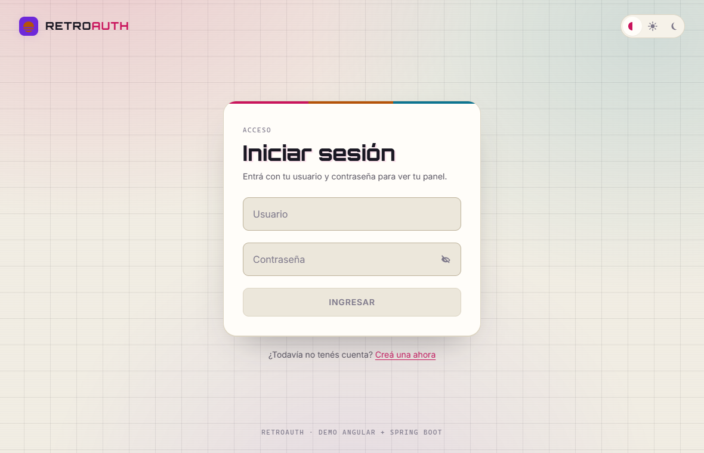
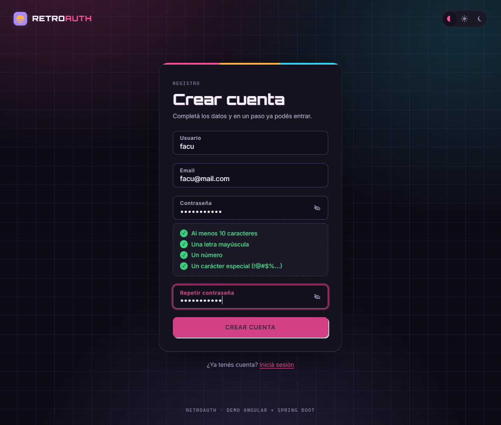
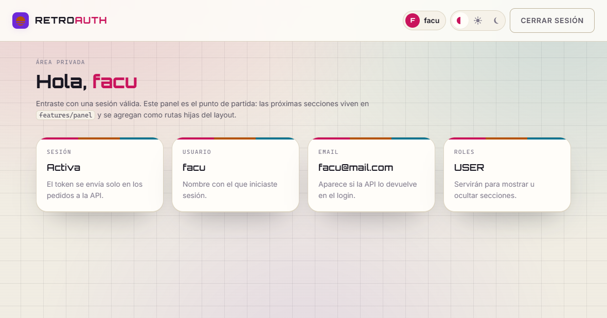

# Retroauth — Frontend (Angular 22)

Frontend de login, registro y panel privado para la API REST de Spring Boot que
está en `../Backend`. Estética retro-moderna, componentes standalone, signals y
formularios reactivos.

| Login (tema claro)       | Registro (tema oscuro)         | Panel                    |
| ------------------------ | ------------------------------ | ------------------------ |
|  |  |  |

## Requisitos

- Node.js 20.19+ (probado con 24.19)
- npm 10+

## Cómo levantarlo

```bash
npm install
npm start
```

Queda en <http://localhost:4200> y apunta a la API en `http://localhost:8080`.
`npm start` usa la configuración `development`, que es la que trae esa URL.

### Scripts

| Script          | Qué hace                                                              |
| --------------- | --------------------------------------------------------------------- |
| `npm start`     | Servidor de desarrollo con recarga en caliente (`development`).       |
| `npm run build` | Build de producción en `dist/frontend`.                               |
| `npm run watch` | Build de desarrollo en modo watch.                                    |
| `npm test`      | Angular pedirá instalar el runner: el proyecto se generó sin pruebas. |

## Dónde se configura la URL de la API

En `src/environments/`. No hay ninguna URL escrita a mano en los componentes:
el único archivo que lee `environment` es `src/app/core/config/api.config.ts`.

| Archivo                                       | Cuándo se usa                 | Valor                       |
| --------------------------------------------- | ----------------------------- | --------------------------- |
| `src/environments/environment.development.ts` | `npm start` y `npm run watch` | `http://localhost:8080`     |
| `src/environments/environment.ts`             | `npm run build` (producción)  | **placeholder a completar** |

El reemplazo lo hace Angular con `fileReplacements` (ver `angular.json`). Antes
de publicar hay que cambiar el placeholder `https://CAMBIAR-POR-LA-URL-DE-LA-API`
por la URL real.

## Contrato esperado de la API

Base: la URL del environment. Los dos endpoints son públicos.

### `POST /auth/register`

Request:

```json
{ "username": "facu", "email": "facu@mail.com", "password": "MiClave123!" }
```

Respuestas que entiende el frontend:

| Código  | Qué hace la app                                           |
| ------- | --------------------------------------------------------- |
| 200/201 | Redirige a `/login` con el aviso "¡Cuenta creada!".       |
| 400     | Muestra el mensaje de validación que devuelva la API.     |
| 409     | "El usuario o el email ya están registrados."             |
| 500+    | "Error interno del servidor."                             |
| 0       | "No pudimos conectarnos… la API puede estar iniciándose." |

El cuerpo de la respuesta 2xx no se usa (alcanza con el código). Si el backend
empieza a devolver el usuario creado, los campos van en `RegisterApiResponse`
(`src/app/core/models/auth.models.ts`).

### `POST /auth/login`

Request:

```json
{ "username": "facu", "password": "MiClave123!" }
```

Respuesta esperada:

```json
{
  "token": "eyJhbGciOi...",
  "user": { "id": 1, "username": "facu", "email": "facu@mail.com", "roles": ["USER"] }
}
```

| Código | Qué hace la app                                  |
| ------ | ------------------------------------------------ |
| 200    | Guarda la sesión y navega a `/panel`.            |
| 401    | "Usuario o contraseña incorrectos."              |
| 400    | Mensaje de validación de la API.                 |
| 500+   | "Error interno del servidor."                    |
| 0      | Aviso de problema de conexión / API iniciándose. |

**El contrato todavía puede cambiar, así que la respuesta se lee en un solo
lugar:** `src/app/core/services/auth-response.mapper.ts`. Ese archivo es el
único que sabe de qué forma viene el JSON; el resto de la app trabaja con el
modelo interno `Session`. Hoy el mapper tolera varias formas:

- token en `token`, `accessToken` o `jwt`;
- usuario anidado en `user` o plano en la raíz;
- si no viene el usuario, usa el `username` con el que se hizo el login.

Si la respuesta no trae ningún token, el mapper lanza `AuthContractError` y la
pantalla muestra un aviso de contrato inesperado en lugar de romperse.

### Header de autorización

`src/app/core/interceptors/auth-token.interceptor.ts` agrega
`Authorization: Bearer <token>` a **todos** los pedidos cuya URL pertenezca a la
API (las de terceros quedan sin firmar, para no filtrar el token).

### CORS

El backend tiene que permitir el origen del frontend
(`http://localhost:4200` en desarrollo) y los headers `Content-Type` y
`Authorization`.

## Rutas

| Ruta        | Acceso          | Notas                                                |
| ----------- | --------------- | ---------------------------------------------------- |
| `/`         | pública         | Redirige a `/login`.                                 |
| `/login`    | solo sin sesión | Con sesión, `guestGuard` manda a `/panel`.           |
| `/register` | solo sin sesión | Ídem.                                                |
| `/panel`    | requiere sesión | `authGuard`; sin sesión va a `/login?volverA=<url>`. |
| `**`        | pública         | Pantalla 404 con la misma estética.                  |

Todas las pantallas se cargan en diferido (`loadComponent` / `loadChildren`).
Después de iniciar sesión, si venía un `volverA` interno se respeta; si es una
URL externa se ignora y se va a `/panel`.

## Estructura

```
src/
  environments/            URL de la API por entorno
  styles/
    tokens.css             ← paleta, tipografías y espaciado (único archivo de tokens)
    base.css               reset, fondo retro (grilla + resplandores + scanlines)
    components.css         tarjetas, campos, botones, avisos, checklist
  app/
    core/
      config/              api.config.ts (única lectura de environment)
      errors/              traducción de errores HTTP a español
      guards/              authGuard, guestGuard
      interceptors/        authTokenInterceptor
      models/              contratos HTTP + modelo interno (Session, AuthUser)
      services/            AuthService, auth-response.mapper, storage, tema, avisos
      validators/          política de contraseñas y coincidencia
    features/
      auth/login/          pantalla /login
      auth/register/       pantalla /register
      panel/               layout + home del área privada
      not-found/           pantalla 404
    shared/
      components/          brand, theme-toggle, alert
      layout/auth-shell/   marco común de login y registro
```

## Estado de sesión

`AuthService` es la única fuente de verdad y expone signals de solo lectura:

```ts
auth.session(); // Session | null
auth.user(); // AuthUser | null
auth.isAuthenticated(); // boolean
auth.token; // string | null (lo usa el interceptor)
```

La sesión se persiste en `localStorage` con la clave `retroauth.session.v1`
(`SessionStorageService`), así que un F5 no cierra la sesión. El valor guardado
se valida al leerlo: si está corrupto se descarta.

## Validación de la contraseña

La política vive en `core/validators/password-policy.validator.ts` como una
lista de reglas independientes, no como una expresión regular suelta:

- al menos 10 caracteres
- una mayúscula
- un número
- un carácter especial

De esa misma lista salen dos cosas: el error del validador
(`{ passwordPolicy: { incumplidas: [...] } }`, que dice **qué** regla falló) y
la checklist en vivo del registro. Agregar una regla en el array la hace
aparecer sola en la interfaz.

La confirmación se valida a nivel de formulario
(`passwordsMatchValidator`), porque necesita comparar dos campos.

Los errores de cada campo aparecen cuando el campo fue tocado o cuando se
intentó enviar, nunca mientras se escribe por primera vez.

## Diseño

- **Tokens** en `src/styles/tokens.css`: paleta, tipografías, escala de
  espaciado (base 4px), radios, sombras y transiciones.
- **Tema claro / oscuro / automático.** El selector de la barra superior guarda
  la preferencia en `localStorage`. Con "automático" no se escribe nada en el
  `<html>` y manda `prefers-color-scheme`; con una elección explícita se escribe
  `data-theme="light|dark"`, que en el CSS pisa a la media query.
- **Retro sin arruinar la usabilidad:** lo retro está en el fondo (grilla,
  resplandores, scanlines), el logo, los títulos en tipografía display y los
  acentos de color. Los formularios son deliberadamente modernos: tarjeta
  centrada, labels flotantes, foco visible, estados de error y de carga.
- **Mobile-first** y responsive; sin librerías de componentes.
- **Accesibilidad:** cada input tiene su `<label for>`, los errores se vinculan
  con `aria-describedby` y `aria-invalid`, los avisos usan `role="alert"` /
  `role="status"`, hay enlace de salto al contenido, foco visible en todo y
  soporte de `prefers-reduced-motion`.

Las tipografías (Orbitron para títulos y logo, Inter para la interfaz) se cargan
desde Google Fonts en `src/index.html`. Si no hay conexión, los fallbacks de los
tokens mantienen la app legible.

## Convención de nombres

- **Inglés** para lo técnico: archivos, clases, servicios, guards, interceptors,
  métodos públicos y los modelos que reflejan el JSON de la API (`username`,
  `password`, `token`).
- **Español** para el dominio y lo interno: variables locales, helpers privados,
  reglas de negocio, y todo el texto que ve el usuario, los comentarios y esta
  documentación.

## Notas

- No hay datos de prueba ni credenciales en el código: el panel muestra
  únicamente lo que devolvió la API.
- TypeScript en modo estricto y `strictTemplates` activado.
- La app es _zoneless_ (sin `zone.js`): el estado se maneja con signals.
