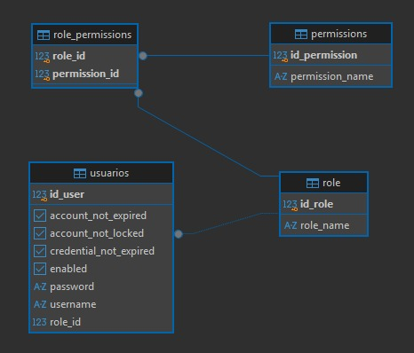

# API de Usuarios, Roles y Permisos con Spring Security

API REST para gestionar usuarios, roles y permisos, protegida con Spring Security y desplegada en la nube junto con un frontend en Angular.

🌐 **Demo:** [apisimple-1.netlify.app](https://apisimple-1.netlify.app)
🔌 **API:** [javafv6-springboot-security.onrender.com](https://javafv6-springboot-security.onrender.com)

> La API corre en el plan gratuito de Render: si estuvo inactiva, el primer request puede tardar hasta un minuto.

## 🛠️ Tecnologías

**Backend:** Java 21 · Spring Boot 4 · Spring Web · Spring Data JPA · Hibernate · Spring Security · Lombok · Maven  
**Base de datos:** PostgreSQL (Neon en producción)  
**Frontend:** Angular (desarrollado con asistencia de IA)  
**Infraestructura:** Docker · Render · Netlify  

## 🗃️ Modelo de datos

- Un **usuario** tiene un único rol (`@ManyToOne`).
- Un **rol** agrupa varios permisos, y un permiso puede estar en varios roles (`@ManyToMany`, tabla intermedia `role_permissions`).
- Roles y permisos son entidades independientes: borrar un usuario no borra su rol, y por eso las relaciones no usan `cascade`.

## 🔐 Apartado de Spring Security

- Autenticación usando usuarios almacenados en la base (`UserDetailsService` propio).
- Contraseñas hasheadas con **BCrypt**.
- Cada usuario recibe como *authorities* su rol (`ROLE_ADMIN`, `ROLE_USER`) y los permisos de ese rol (`READ`, `CREATE`, …), lo que permite autorizar tanto por rol como por permiso.
- Sesiones **stateless** y **CORS** habilitado solo para el frontend y el entorno local.
- Credenciales de base de datos externalizadas en variables de entorno.
- Esta práctica no incluye JWT ni OAuth2. La siguiente práctica seguramente incluya Keycloak para integrarlos.

## Extras acerca del proyecto
- Inclui la dependencia de SpringDoc para documentar todos mis endpoints. No extendi mucho ya que lo hice al final, pero me queda pendiente darle un poco mas de gracia a esta documentacion haciendo uso de esta herramienta.
- Cree mis propias excepciones para enviar diferentes códigos HTTP al front y que se manejen como deban. Esto lo hice creando mi propia clase que recibe Excepcion.class.
- Para el Front usé Netlify, para el Back usé Render, y para la BBDD USE Neon. 
